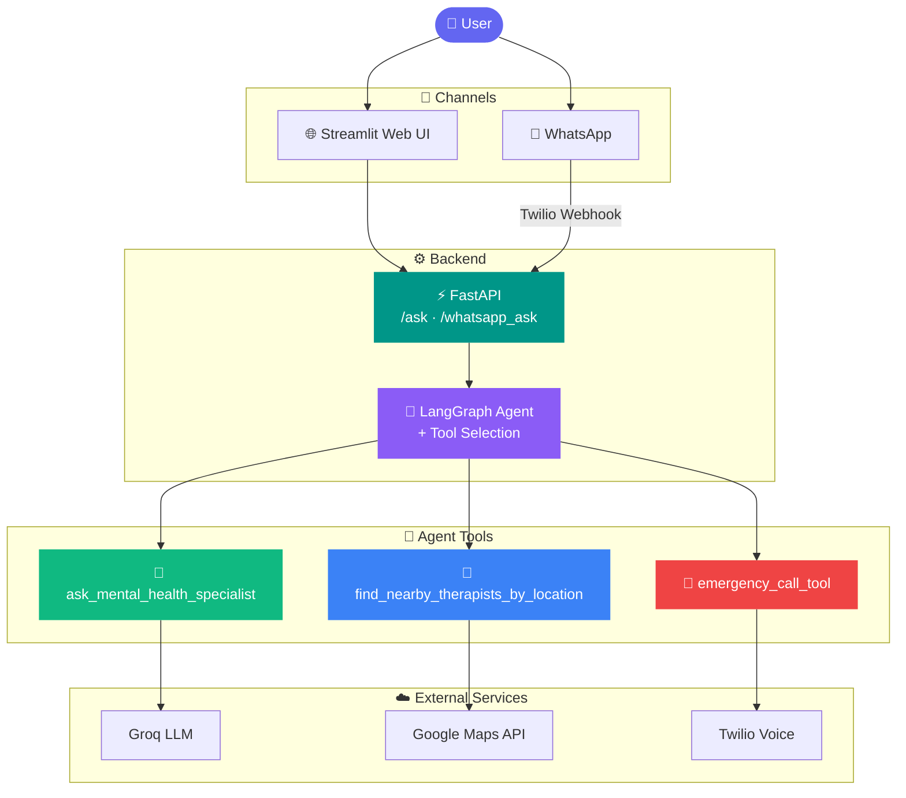
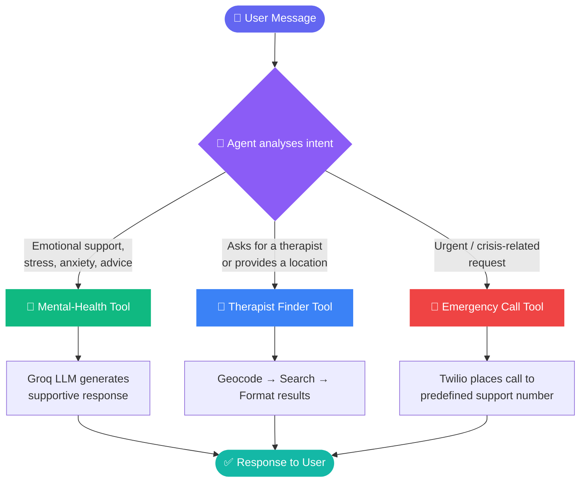
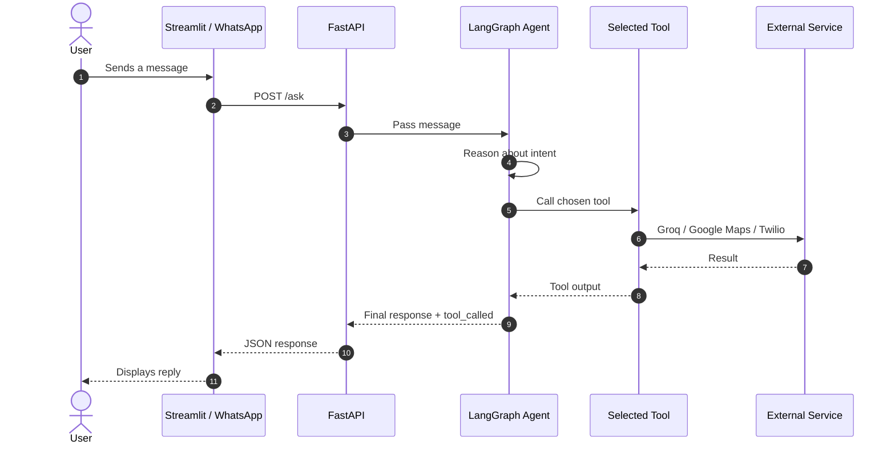
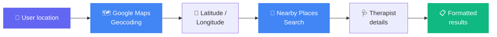
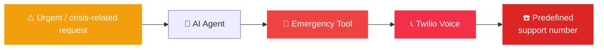
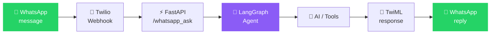
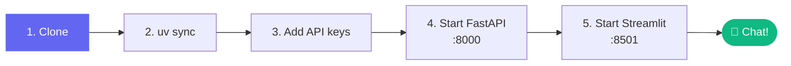
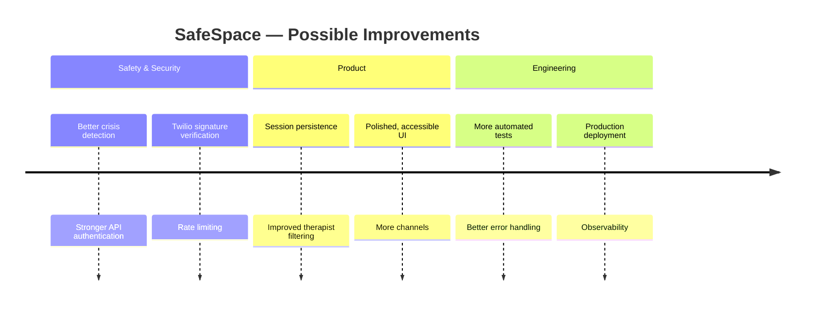

<div align="center">

# 🧠 SafeSpace

### AI Mental Health Companion

*Supportive conversations · Nearby therapist search · Emergency-support pathway*

<br>


<br>

[✨ Features](#-features) •
[🏗️ Architecture](#-architecture) •
[🚀 Quick Start](#-quick-start) •
[🔌 API](#-api-reference) •
[📲 WhatsApp](#-whatsapp-setup) •
[🔒 Security](#-security-considerations)

</div>

---

> [!WARNING]
> **Disclaimer:** SafeSpace is an educational/technical demonstration. It is **not** a replacement for licensed mental-health professionals or emergency services. If you or someone you know is in immediate danger, contact your local emergency number right away.

---

## 📖 Overview

SafeSpace is a full-stack AI application that goes beyond a basic chatbot. A **LangGraph agent** reads each message and decides *which tool* is best suited to respond — an empathetic mental-health model, a therapist-location search, or an emergency voice call.

<div align="center">

| 💬 | 🧠 | 📍 | 📞 |
|:---:|:---:|:---:|:---:|
| **Talk** | **Reason** | **Locate** | **Escalate** |
| Supportive LLM conversation | Agent picks the right tool | Finds therapists near you | Triggers an emergency call |

</div>

---

## ✨ Features

| Capability | Description | Powered by |
|---|---|---|
| 💬 **AI Conversation** | Supportive, empathetic responses | Groq LLM |
| 🧠 **Tool-Using Agent** | Decides which tool a request needs | LangGraph + LangChain |
| 📍 **Therapist Finder** | Searches nearby therapists by location | Google Maps API |
| 📞 **Emergency Support** | Initiates a predefined voice call | Twilio Voice |
| 🌐 **Web Chat** | Clean chat interface | Streamlit |
| 📱 **WhatsApp Chat** | Converse through WhatsApp | Twilio Webhook |
| ⚡ **REST Backend** | REST API backend | FastAPI |

---

## 🏗️ Architecture

### System Overview



### 🧭 Agent Decision Flow

The agent reads every message and routes it to the most appropriate tool.



### 🔄 Request Lifecycle



---

## 🔍 Core Features in Detail

### 💬 Conversational AI

Users chat through the web UI or WhatsApp. The backend passes the conversation to the agent, which uses a **Groq-hosted LLM** via LangChain/LangGraph to craft supportive, non-judgmental replies.

### 📍 Nearby Therapist Search



The search looks for psychotherapist-related places within a defined radius and returns available contact information.

### 📞 Emergency Calling



> [!CAUTION]
> This component is for **demonstration only** and needs careful design, consent flows, and legal review before any real-world use.

### 📱 WhatsApp Support



---

## 🛠️ Tech Stack

<div align="center">

| Layer | Technologies |
|:---:|:---|
| **Backend** |     |
| **AI / Agent** |    |
| **Frontend** |  |
| **Services** |   |
| **Dev Tools** |   Requests · Geopy |

</div>

---

## 📁 Project Structure

```text
safespace-ai-therapist/
│
├── 📂 backend/
│   ├── 🧠 ai_agent.py          # LangGraph agent, system prompt, tool definitions
│   ├── ⚙️  config.py            # API keys & credentials (never commit!)
│   ├── ⚡ main.py              # FastAPI app & HTTP endpoints
│   ├── 🧰 tools.py             # AI, Twilio & Maps integrations
│   └── 🧪 test_location_tool.py
│
├── 🌐 frontend.py              # Streamlit chat interface
├── 📦 pyproject.toml
├── 📘 README.md
└── 🚫 .gitignore
```

<details>
<summary><b>📂 File responsibilities (click to expand)</b></summary>

<br>

| File | Responsibility |
|---|---|
| `backend/main.py` | FastAPI layer and HTTP endpoints |
| `backend/ai_agent.py` | LangGraph agent, system instructions, tool definitions |
| `backend/tools.py` | Lower-level integrations: AI, Twilio, supporting functions |
| `backend/config.py` | API configuration and credentials |
| `frontend.py` | Streamlit chat UI that talks to the FastAPI backend |

</details>

---

## 🚀 Quick Start

### Prerequisites

- ✅ Python **3.11+**
- ✅ [`uv`](https://github.com/astral-sh/uv) package manager
- ✅ Accounts / API keys for **Groq**, **Google Maps**, and **Twilio**

### 1️⃣ Clone the repository

```bash
git clone <YOUR_GITHUB_REPOSITORY_URL>
cd safespace-ai-therapist
```

### 2️⃣ Install dependencies

```bash
uv sync
```

Activate the environment if needed:

```bash
# macOS / Linux
source .venv/bin/activate
```

```powershell
# Windows PowerShell
.venv\Scripts\Activate.ps1
```

### 3️⃣ Configure API keys

Update `backend/config.py` with your API credentials:

```python
GROQ_API_KEY = "your_groq_api_key"
GOOGLE_MAPS_API_KEY = "your_google_maps_api_key"

TWILIO_ACCOUNT_SID = "your_twilio_account_sid"
TWILIO_AUTH_TOKEN = "your_twilio_auth_token"

TWILIO_FROM_NUMBER = "+1234567890"
TWILIO_EMERGENCY_TO_NUMBER = "+1987654321"
```

> [!IMPORTANT]
> **Never push real credentials to GitHub.** Make sure `backend/config.py` is listed in `.gitignore`, or load secrets from environment variables instead.

### 4️⃣ Run the backend

```bash
uv run uvicorn backend.main:app --host 0.0.0.0 --port 8000 --reload
```

### 5️⃣ Run the frontend (new terminal)

```bash
uv run streamlit run frontend.py
```

Open **http://localhost:8501** 🎉



---

## 🔌 API Reference

| Method | Endpoint | Purpose |
|:---:|---|---|
| `POST` | `/ask` | Send a message from the web UI |
| `POST` | `/whatsapp_ask` | Twilio WhatsApp webhook |

### `POST /ask`

**Request**

```json
{
  "message": "I've been feeling really anxious lately."
}
```

**Response**

```json
{
  "response": "AI-generated supportive response...",
  "tool_called": "ask_mental_health_specialist"
}
```

> 💡 The `tool_called` field tells you which agent capability handled the request.

---

## 🧰 Agent Tools

| Tool | Purpose | Service |
|---|---|:---:|
| 💚 `ask_mental_health_specialist()` | Conversational mental-health support | Groq |
| 📍 `find_nearby_therapists_by_location()` | Finds therapists near a user-provided location | Google Maps |
| 🚨 `emergency_call_tool()` | Starts a predefined voice-call workflow | Twilio |

The agent chooses a tool based on its system instructions and the content of the user's message.

---

## 📲 WhatsApp Setup

**1. Expose your local server**

```bash
ngrok http 8000
```

**2. Configure the Twilio WhatsApp webhook**

| Setting | Value |
|---|---|
| URL | `https://YOUR-NGROK-DOMAIN/whatsapp_ask` |
| Method | `POST` |

**3. Send a message** to your Twilio WhatsApp number — it is forwarded to FastAPI and answered by the agent.

---

## 🧪 Testing

```bash
uv run pytest
```

A location-tool example lives in `backend/test_location_tool.py`.

---

## 🔒 Security Considerations

This app handles sensitive conversations and external APIs, so treat security as a first-class concern.

| Status | Recommendation |
|:---:|---|
| 🔑 | Store secrets in **environment variables** |
| 🚫 | Never commit API keys |
| ✍️ | Validate **Twilio webhook signatures** |
| ⏱️ | Add **rate limiting** |
| 🛡️ | Add **authentication** to production APIs |
| 🧯 | Improve error handling for external services |
| 📝 | Log without exposing sensitive user data |
| 📢 | Clearly communicate system limitations to users |

---

## 🗺️ Roadmap



- [ ] Conversation / session persistence
- [ ] Better crisis detection
- [ ] Stronger API authentication
- [ ] Twilio signature verification
- [ ] Rate limiting
- [ ] More comprehensive automated tests
- [ ] Improved therapist search and filtering
- [ ] Production deployment
- [ ] More accessible and polished UI
- [ ] Additional communication channels

---

## ⚠️ Safety Notice

SafeSpace is a **technical and educational demonstration** combining conversational AI with external tools. It must **not** be treated as a medical or psychological service. Any real-world deployment would need clinical, legal, privacy, security, and regulatory review.

---

## 👨‍💻 About

SafeSpace is a technical project exploring **LLMs, AI agents, APIs, FastAPI, Streamlit, Twilio, and location-based services**.

The project demonstrates how an AI agent can combine language-model capabilities with external tools to create an interactive application.

<br>

<div align="center">

**🧠 SafeSpace**

*AI-powered conversational support with tool-based intelligence*

⭐ If you found this project useful, consider giving it a star!

</div>
